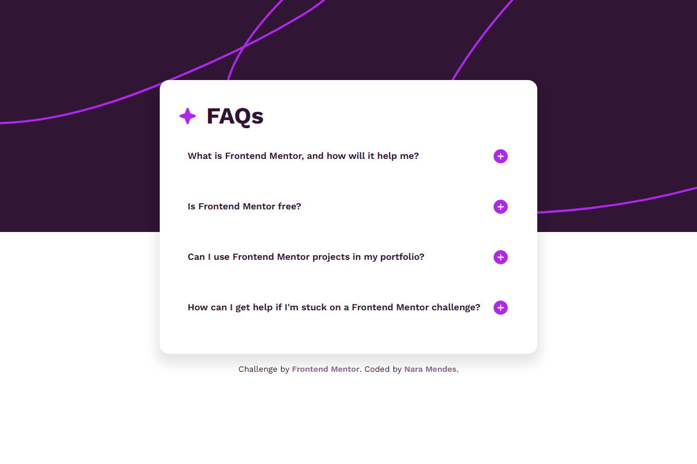

# FAQ Accordion



A responsive FAQ (Frequently Asked Questions) accordion component built with HTML, CSS, and JavaScript. This project is a solution to the Frontend Mentor challenge.

## 🚀 Live Demo

You can view the live project by opening `index.html` in your browser, or visit the GitHub repository: [nara-md/fm-faq-accordion](https://github.com/nara-md/fm-faq-accordion)

## ✨ Features

- **Responsive Design**: Adapts seamlessly from desktop to mobile devices
- **Interactive Accordion**: Click on any question to expand/collapse the answer
- **Accessible**: Semantic HTML structure with proper focus states
- **Modern Styling**: Clean, modern design with CSS custom properties

## 🛠️ Technologies Used

- **HTML5**: Semantic markup structure
- **CSS3**: 
  - Custom properties (CSS variables) for theming
  - Flexbox for layout
  - Media queries for responsive design
- **JavaScript**: Vanilla JS for accordion functionality
- **Google Fonts**: Work Sans font family

## 📁 Project Structure

```
fm-faq-accordion/
├── index.html
├── README.md
├── assets/
│   ├── images/
│   │   ├── background-pattern-desktop.svg
│   │   ├── background-pattern-mobile.svg
│   │   ├── favicon-32x32.png
│   │   ├── icon-minus.svg
│   │   ├── icon-plus.svg
│   │   └── icon-star.svg
│   ├── scripts/
│   │   └── script.js
│   └── styles/
│       ├── reset.css
│       └── style.css
```

## 🎨 Design Highlights

### Color Palette
- **White**: `hsl(0, 100%, 100%)` - Background and card
- **Purple 100**: `hsl(275, 100%, 97%)` - Hover states
- **Purple 600**: `hsl(292, 16%, 49%)` - Answer text
- **Purple 950**: `hsl(292, 42%, 14%)` - Body text

### Responsive Breakpoints
- **Desktop**: Background pattern repeats horizontally
- **Mobile (≤768px)**: Mobile-specific background pattern, adjusted padding and font sizes

## 🔧 How It Works

### JavaScript Functionality
The accordion uses event delegation to handle clicks on FAQ questions:

1. When a question is clicked, all other answers are closed
2. The clicked question's answer is toggled open/closed
3. The icon changes from plus to minus (and vice versa) to indicate state
4. CSS classes control the visibility of answers

## 📱 Responsive Behavior

- **Desktop**: Full-width background pattern, larger title font
- **Mobile**: Centered card, mobile background pattern, optimized spacing

## 🚀 Getting Started

1. Clone the repository:
   ```bash
   git clone https://github.com/nara-md/fm-faq-accordion.git
   ```

2. Open `index.html` in your browser

No build tools or dependencies required - it's a pure HTML/CSS/JavaScript project!

## 👤 Author

**Nara Mendes**
- GitHub: [@nara-md](https://github.com/nara-md)

## 🙏 Acknowledgments

- Challenge by [Frontend Mentor](https://www.frontendmentor.io)
- Solution coded by Nara Mendes
